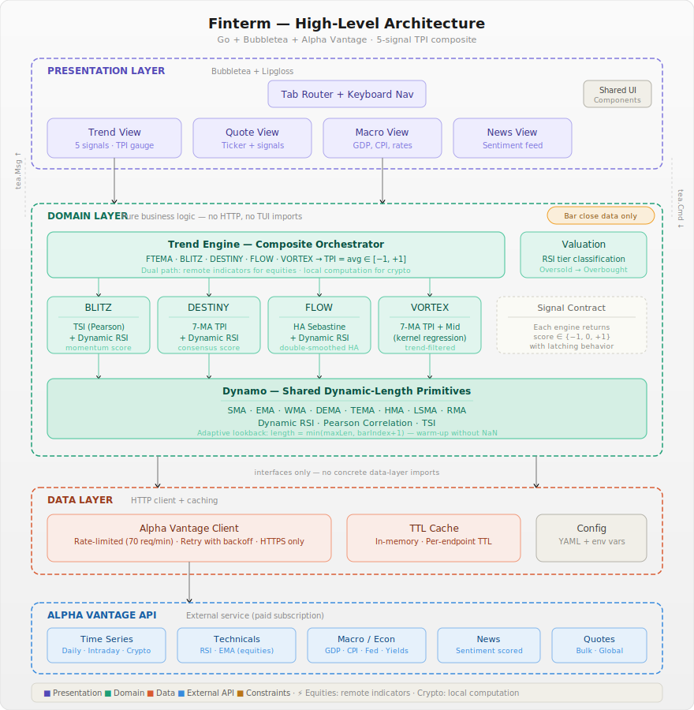

<p align="center">
  <strong>finterm</strong><br/>
  <em>A terminal-based financial analysis tool built with Go and Bubbletea.</em>
</p>

<p align="center">
  <a href="https://github.com/shinsekai/finterm/actions/workflows/ci.yml"></a>
  <a href="https://goreportcard.com/report/github.com/shinsekai/finterm"></a>
  <a href="https://github.com/shinsekai/finterm/blob/main/LICENSE"></a>
  <a href="https://github.com/shinsekai/finterm/releases/latest"></a>
  
</p>

<p align="center">
  Trend-following signals · Real-time quotes · Macro dashboard · Sentiment-scored news · Commodities dashboard
</p>

---

## What is Finterm?

Finterm is a keyboard-driven financial analysis tool that runs entirely in your terminal. It provides five independent trend signal systems (EMA crossover, BLITZ, DESTINY, FLOW, and VORTEX), RSI-based valuation, macroeconomic indicators, and sentiment-scored news — all powered by the [Alpha Vantage](https://www.alphavantage.co/) API.

It's designed for traders and analysts who live in the terminal and want a fast, unified view of market data without leaving their workflow.

**Key principles:**

- **TradingView parity** — RSI and EMA calculations match TradingView's `ta.rsi()` and `ta.ema()` exactly. RSI uses Wilder's RMA smoothing (`alpha = 1/length`), EMA seeds with the first source value.
- **Bar close only** — All trend and valuation signals use completed (closed) bars exclusively. No intra-bar repainting. Once a bar closes, its signal is final.
- **Dual-path indicators** — Equities use Alpha Vantage's server-side technicals. Crypto uses locally computed indicators (since AV's technical endpoints don't cover weekend data). Local implementations also serve as a fallback.
- **Single binary** — `go build` produces one static binary. No runtime dependencies, no Docker, no Node.

## Features

**Trend Following** — Watchlist table with a TPI composite score and five independent signal systems per ticker:

- **TPI** — Trend Probability Indicator: averages FTEMA, BLITZ, DESTINY, FLOW, and VORTEX into a single score (-1 to +1) with a color-gradient gauge. TPI > 0 = LONG, TPI ≤ 0 = CASH.
- **FTEMA** — Fast/slow EMA crossover (EMA 10 vs EMA 20). The classic trend direction signal.
- **BLITZ** — Correlation-based scoring combining TSI (Pearson correlation), adaptive RSI, and threshold confirmation. Fast and reactive.
- **DESTINY** — Consensus-based scoring using 7 moving averages (SMA, EMA, DEMA, TEMA, WMA, HMA, LSMA) confirmed by adaptive RSI. Conservative, high-conviction.
- **FLOW** — Double-smoothed Heikin-Ashi momentum (Sebastine indicator) using OHLC data with adaptive RSI confirmation. Captures trend through synthetic candle structure.
- **VORTEX** — 7-MA TPI gated by a kernel-regression Mid band (Epanechnikov + Logistic + Wave) and Dynamic RSI. Long-term trend filter layered on DESTINY's consensus scoring.

SYMBOL  TPI                     FTEMA      BLITZ      DESTINY    FLOW       VORTEX     PRICE    RSI  VALUATION
━━━━━━━━━━━━━━━━━━━━━━━━━━━━━━━━━━━━━━━━━━━━━━━━━━━━━━━━━━━━━━━━━━━━━━━━━━━━━━━━━━━━━━━━━━━━━━━━━━━━━━━━━
QQQ     ░░░░░▓▓░░░ +0.25 LONG  ▲  LONG    ▲  LONG    ▼ SHORT               $604.52  67.97  ◇ Overval
SPY     ░░░░░▓░░░░ +0.00 CASH  ▲  LONG               ▼ SHORT   ▼ SHORT              $673.59  67.56  ◇ Overval
BTC     ░░░░░▓▓░░░ +0.25 LONG  ▲  LONG    ▲  LONG    ▼ SHORT                           $74,179  62.06  ◇ Overval
ETH     ░░░░░▓░░░░ +0.00 CASH  ▲  LONG    ▲  LONG    ▼ SHORT   ▼ SHORT              $2,323   64.11  ◇ Overval
SOL     ░░▓▓▓▓░░░░░ -1.00 CASH  ▼ SHORT    ▼ SHORT    ▼ SHORT   ▼ SHORT   ▼ SHORT     $83.76  53.55  ○ Fair val

**Quote Lookup** — Type any ticker to get real-time price, volume, change, RSI gauge, signal system analysis (FTEMA, BLITZ, DESTINY, FLOW, VORTEX, TPI composite with gauge), and company fundamentals (press `F` to toggle for equities).

**Macro Dashboard** — Paneled view of GDP, CPI, inflation, federal funds rate, treasury yields, unemployment, and nonfarm payroll.

**News Feed** — Scrollable, sentiment-scored articles with ticker/topic filters, color-coded by sentiment (bullish/bearish/neutral).

**Chart View** — Candlestick chart with TPI overlay showing price action (~70% height) and composite TPI trajectory (~30% height). Supports multiple timeframes (intraday, daily, weekly, monthly), zoom (+/-), pan (h/l), and ticker cycling (j/k). Uses cell-based OHLC rendering and braille canvas for 2×4 subpixel TPI resolution.

**Commodities Dashboard** — Table-based view of commodity prices with sparklines, latest values, and period-over-period change. Supports WTI, BRENT, NATURAL_GAS, COPPER, ALUMINUM, WHEAT, CORN, COFFEE, SUGAR, and COTTON. Configurable intervals (daily, weekly, monthly, quarterly, annual).

**Navigation** — Fully keyboard-driven: `1-6` for tabs, `j/k` or arrows for rows, `r` to refresh, `?` for help, `q` to quit.

## Architecture

Finterm follows a strict layered architecture with clear dependency boundaries. The domain layer is pure business logic with zero HTTP or TUI imports.

<p align="center">
  
</p>

| Layer | Package | Responsibility |
|---|---|---|
| **Presentation** | `internal/tui/` | Bubbletea models, views, Lipgloss styling, tab routing |
| **Domain** | `internal/domain/` | Indicator computation (RSI, EMA), trend scoring, valuation, BLITZ + DESTINY engines |
| **Data** | `internal/alphavantage/`, `internal/cache/` | HTTP client with rate limiting and retry, TTL cache |
| **Config** | `internal/config/` | YAML + env var loading, validation |

The domain layer communicates with the data layer through interfaces — never concrete types. `cmd/finterm/main.go` wires everything together via constructor injection.

### Indicator Logic

| Indicator | Method | Details |
|---|---|---|
| **RSI** | Wilder's RMA smoothing | `alpha = 1/period`, seeded with SMA. Default period: 14 |
| **EMA** | Standard exponential | `alpha = 2/(period+1)`, seeded with first source value. Periods: 10 (fast), 20 (slow) |

| Signal | Rule |
|---|---|
| **FTEMA** | `EMA(10) > EMA(20)` → LONG, `EMA(10) < EMA(20)` → SHORT |
| **TPI** | Average of FTEMA (+1/-1), BLITZ (+1/-1/0), DESTINY (+1/-1/0), FLOW (+1/-1/0), VORTEX (+1/-1/0). TPI > 0 → LONG, TPI ≤ 0 → CASH |
| **Valuation** | RSI < 30 → Oversold, 30–45 → Undervalued, 45–55 → Fair, 55–70 → Overvalued, > 70 → Overbought |

### BLITZ System

The BLITZ trend following system uses three independent confirmations to generate high-conviction signals:

| Component | Computation | Purpose |
|---|---|---|
| **TSI** | Pearson correlation of close vs bar index over 14 bars | Trend direction filter (+1 = up, -1 = down) |
| **Dynamic RSI** | Wilder's RSI with adaptive lookback (`min(12, bars_available)`) | Momentum strength |
| **RSI Smooth** | EMA of Dynamic RSI, same adaptive length | Noise reduction |

**Signal rules**: LONG when `TSI > 0` AND `RSI Smooth is rising` AND `RSI Smooth > 48`. SHORT when `TSI < 0` AND `RSI Smooth is falling` AND `RSI Smooth < 48`. Score latches — holds until the opposite signal fires.

**Dynamic length adaptation**: Unlike standard indicators that produce NaN for the first N bars, BLITZ adapts its lookback period to available data. At bar 5, a "12-period RSI" uses a 5-period lookback. This means signals start earlier with no warmup gap.

### DESTINY System

The DESTINY trend following system uses a consensus of 7 moving averages to build the Trend Probability Indicator (TPI), confirmed by Dynamic RSI:

| Component | Computation | Purpose |
|---|---|---|
| **SMA** | Simple MA, period 45 | Baseline trend |
| **EMA** | Exponential MA, period 45 | Responsive trend |
| **DEMA** | Double EMA, period 90 | Lag-reduced trend |
| **TEMA** | Triple EMA, period 135 | Minimal-lag trend |
| **WMA** | Weighted MA, period 45 | Recency-biased trend |
| **HMA** | Hull MA, period 45 | Fast-response trend |
| **LSMA** | Least Squares MA, period 45, offset 6 | Regression-projected trend |

Each MA is scored: +1 (rising), -1 (falling), 0 (flat). The TPI is the average of all 7 scores, ranging from -1 to +1.

**Signal rules**: LONG when `TPI > 0.5` AND `RSI Smooth is rising` AND `RSI Smooth > 56`. SHORT when `TPI < -0.5` OR (`RSI Smooth is falling` AND `RSI Smooth < 56`). The asymmetry is deliberate — entries require consensus, exits are more aggressive.

**Dynamic length adaptation**: All 7 MAs and the RSI use the same adaptive-length pattern as BLITZ, allowing signals on limited data.


### FLOW System

The FLOW trend following system uses double-smoothed Heikin-Ashi candles (Sebastine indicator) combined with Dynamic RSI for trend following signals:

| Component | Computation | Purpose |
|---|---|---|
| **Sebastine** | EMA(45) of OHLC → Heikin-Ashi → EMA(50) of HA open/close → (close/open - 1) × 100 | Captures trend through synthetic candle body ratio |
| **Dynamic RSI** | Wilder's RSI with adaptive lookback (length 14) | Momentum strength |
| **RSI Smooth** | EMA of Dynamic RSI (length 14) | Noise reduction |

**Signal rules**: LONG when `Sebastine > 0` AND `RSI Smooth is rising` AND `RSI Smooth > 55`. SHORT when `Sebastine < 0` OR (`RSI Smooth is falling` AND `RSI Smooth < 55`). The asymmetry matches DESTINY — entries require consensus, exits are more aggressive.

**Dynamic length adaptation**: All components use the same adaptive-length pattern as BLITZ, allowing signals on limited data.

### VORTEX System

The VORTEX trend following system uses 7-MA TPI gated by a kernel-regression Mid band with Dynamic RSI for long-term trend filtering:

| Component | Computation | Purpose |
|---|---|---|
| **7-MA TPI** | Same 7 MAs as DESTINY (SMA, EMA, DEMA, TEMA, WMA, HMA, LSMA) | Consensus trend indicator |
| **Mid Band** | Kernel-weighted deviation ratios (Epanechnikov, Logistic, Wave) blended with close → EMA(150) | Long-term trend filter |
| **Wave** | Wave-weighted regression line | Parity with Pine source |
| **Dynamic RSI** | Wilder's RSI with adaptive lookback (length 16) | Momentum strength |
| **RSI Smooth** | EMA of Dynamic RSI (length 16) | Noise reduction |

**Signal rules**: LONG when `TPI > 0.5` AND `close > Mid` AND `RSI Smooth is rising` AND `RSI Smooth > 56`. SHORT when `TPI < -0.5` OR `close < Mid` OR (`RSI Smooth is falling` AND `RSI Smooth < 56`). The asymmetry follows DESTINY/FLOW — entries require all conditions (AND), exits are more aggressive (OR).

**Dynamic length adaptation**: All components use the same adaptive-length pattern as BLITZ, allowing signals on limited data.

### Data Flow

```
User input → tea.Cmd → fetch (AV client + cache) → domain engine → tea.Msg → view update
```

For equities, RSI and EMA are fetched from Alpha Vantage's server-side endpoints. For crypto, raw OHLCV data is fetched and indicators are computed locally in Go, because AV's technical endpoints follow equity market hours and exclude weekends.

## Requirements

- **Go 1.26+**
- **Alpha Vantage API key** — [get one here](https://www.alphavantage.co/support/#api-key) (paid tier recommended for 75 req/min)
- A terminal with 256-color support (iTerm2, Alacritty, kitty, Windows Terminal, etc.)

## Installation

### From source

```bash
git clone https://github.com/shinsekai/finterm.git
cd finterm
make build
./bin/finterm
```

### With `go install`

```bash
go install github.com/shinsekai/finterm/cmd/finterm@latest
```

## Configuration

Finterm loads configuration from `config.yaml` in the working directory. Environment variables take precedence.

```bash
# Minimum: set your API key
export FINTERM_AV_API_KEY="your_key_here"

# Or copy and edit the example config
cp config.example.yaml config.yaml
```

### Example `config.yaml`

```yaml
api:
  key: ""                          # Or use FINTERM_AV_API_KEY env var
  base_url: "https://www.alphavantage.co/query"
  rate_limit: 70                   # Requests per minute (AV premium: 75)
  timeout: 10s
  max_retries: 3

watchlist:
  equities: [AAPL, MSFT, GOOGL, AMZN, NVDA]
  crypto: [BTC, ETH, SOL]

trend:
  rsi_period: 14
  ema_fast: 10
  ema_slow: 20

valuation:
  rsi_period: 14
  oversold: 30
  undervalued: 45
  fair_low: 45
  fair_high: 55
  overvalued: 70
  overbought: 70

commodities:
  watchlist: [WTI, BRENT, NATURAL_GAS, COPPER, ALUMINUM, WHEAT, CORN, COFFEE, SUGAR, COTTON]
  interval: daily                     # daily | weekly | monthly | quarterly | annual

blitz:
  rsi_length: 12                   # Dynamic RSI lookback period
  tsi_period: 14                   # Pearson correlation lookback period
  threshold: 48                     # RSI smooth threshold for signal generation

destiny:
  ma_length: 45                     # Base period for 7 MAs (DEMA uses 2×, TEMA uses 3×)
  rsi_length: 18                    # Dynamic RSI lookback period
  rsi_threshold: 56                 # RSI smooth threshold for signal confirmation
  lsma_offset: 6                    # LSMA projection offset
flow:
  rsi_length: 14
  rsi_threshold: 55
  fast_length: 45
  slow_length: 50
vortex:
  ma_length: 45                     # Base period for 7 MAs (DEMA uses 2×, TEMA uses 3×)
  rsi_length: 16                    # Dynamic RSI lookback period
  rsi_threshold: 56                 # RSI smooth threshold for signal confirmation
  lsma_offset: 6                    # LSMA projection offset
  kernel_bandwidth: 45              # Kernel bandwidth for Mid band calculation
  wave_width: 2.0                   # Wave width for wave-weighted regression
  mid_length: 150                   # Mid band SMA length (long-term trend filter)


cache:
  intraday_ttl: 60s
  daily_ttl: 1h
  macro_ttl: 6h
  news_ttl: 5m
  crypto_ttl: 5m

theme:
  style: "default"                 # default | minimal | colorblind
```

## Keyboard Shortcuts

| Key | Action |
|---|---|
| `1` / `2` / `3` / `4` / `5` / `6` | Switch to Trend / Quote / Macro / News / Chart / Commodities tab |
| `Tab` | Cycle to next tab |
| `j` / `k` or `↑` / `↓` | Navigate rows (Trend, News) / Cycle ticker (Chart) |
| `Enter` | Submit ticker (Quote view) / Open article (News view) |
| `F` | Toggle fundamentals panel (Quote view) |
| `r` | Refresh current view |
| `1` / `2` / `3` / `4` | Chart: Set timeframe (intraday/daily/weekly/monthly) |
| `+` / `-` | Chart: Zoom in/out (window: 30/60/110 bars) |
| `h` / `l` or `←` / `→` | Chart: Pan left/right |
| `f` | Toggle filter (News view) |
| `s` | Toggle sort (News view) |
| `?` | Show help overlay |
| `q` / `Ctrl+C` | Quit |

## Development

### Prerequisites

```bash
# Install dependencies
go mod download

# Install linting tools
go install github.com/golangci/golangci-lint/cmd/golangci-lint@latest
go install golang.org/x/vuln/cmd/govulncheck@latest
```

### Commands

```bash
make build          # Build binary to ./bin/finterm
make run            # Build and run
make test           # Run all tests
make test-race      # Run tests with race detector
make lint           # Run golangci-lint
make vet            # Run go vet
make fmt            # Format all code
make clean          # Remove build artifacts
```

### Running Tests

```bash
# All tests
go test ./...

# With coverage
go test -coverprofile=coverage.out ./internal/...
go tool cover -func=coverage.out

# Domain layer only (indicator logic)
go test ./internal/domain/...

# With race detector
go test -race ./...
```

### Project Structure

```
finterm/
├── cmd/finterm/main.go              # Entry point — config, DI, bootstrap
├── internal/
│   ├── tui/                         # Bubbletea views and components
│   │   ├── app.go                   # Root model + tab router
│   │   ├── chart/                   # Candlestick chart with TPI overlay
│   │   ├── trend/                   # Trend following view
│   │   ├── quote/                   # Quote lookup view
│   │   ├── macro/                   # Macro dashboard view
│   │   ├── news/                    # News feed view
│   │   ├── commodities/             # Commodities dashboard view
│   │   └── components/              # Shared UI (spinner, table, help)
│   ├── domain/                      # Pure business logic
│   │   ├── trend/                   # Trend engine + scoring
│   │   │   └── indicators/          # RSI, EMA (local + remote)
│   │   ├── valuation/               # RSI-based valuation
│   │   ├── dynamo/                  # Shared dynamic-length MA primitives (SMA, EMA, RMA, WMA, DEMA, TEMA, HMA, LSMA, RSI, TSI)
│   │   ├── blitz/                   # BLITZ signal engine
│   │   ├── destiny/                 # DESTINY signal engine
│   │   ├── flow/                    # FLOW signal engine
│   │   └── vortex/                  # VORTEX signal engine
│   ├── alphavantage/                # API client + typed models
│   ├── cache/                       # In-memory TTL cache
│   └── config/                      # YAML + env var loading
├── config.example.yaml
├── CLAUDE.md                        # Project guidelines (for AI-assisted dev)
├── PRD.md                           # Product requirements
├── EPICS.md                         # Epics and tasks
└── Makefile
```

### Contributing

1. Read `CLAUDE.md` — it's the project constitution covering coding standards, architecture rules, and testing requirements.
2. Pick a task from `EPICS.md` — each task is self-contained with acceptance criteria and test definitions.
3. Follow the conventions: `gofmt`, `go vet`, table-driven tests, error wrapping with context.
4. Run `make test lint vet` before submitting.
5. Commit messages: `<scope>: <description>` (e.g., `trend: add local RSI computation`).

### Design Decisions

**Why a composite TPI instead of one signal?** Each signal system captures a different dimension of trend. FTEMA is a simple lagging direction indicator. BLITZ is fast and reactive, using Pearson correlation. DESTINY is conservative, polling 7 MA types for consensus. The TPI averages all four into a single score: LONG when the average is positive, CASH when it isn't. This prevents over-reliance on any single method — a ticker is only LONG when the weight of evidence supports it.

**Why compute crypto indicators locally?** Alpha Vantage's technical endpoints (RSI, EMA) map crypto symbols to exchange-listed instruments that follow equity market hours — no weekend data, which creates gaps in 24/7 crypto markets. Fetching raw OHLCV from the crypto endpoints and computing locally ensures continuous, accurate signals.

**Why bar close only?** Intra-bar computation causes "repainting" — a signal that appears mid-bar might vanish by the time the bar closes. Using completed bars only means every signal is final. This matches how TradingView strategies execute by default.

**Why TradingView as the reference?** It's what most retail traders use. If Finterm's RSI says 52.3 and TradingView says 52.3 for the same data, trust is established immediately. The key subtlety: TradingView's RSI uses RMA smoothing (alpha = 1/length), not standard EMA smoothing (alpha = 2/(length+1)). Getting this wrong produces visibly different values.

**Why five trend signals (FTEMA + BLITZ + DESTINY + FLOW + VORTEX)?** Each operates at a different speed and philosophy. FTEMA is a simple, lagging binary — the trend is up or down. BLITZ uses Pearson correlation for trend direction and is fast and reactive (3 conditions, all AND). DESTINY polls 7 different moving averages for consensus and is more conservative — it waits for broad agreement before calling a trend. The asymmetric exit logic (OR for shorts) makes DESTINY quick to protect but slow to commit. FLOW uses Heikin-Ashi candle structure to capture trend through synthetic body ratios. VORTEX adds a long-term trend filter using kernel regression, layering on DESTINY's consensus scoring. Five signals, five speeds: when all agree, conviction is highest; when they diverge progressively, risk is rising.

**Why 7 moving averages in DESTINY?** Each MA type captures a different aspect of trend: SMA is stable but laggy, EMA reacts faster, DEMA and TEMA progressively reduce lag, WMA biases toward recent prices, HMA is the fastest responder, and LSMA projects the regression line forward. Averaging their direction votes creates a "wisdom of the crowd" signal — if 5+ out of 7 agree the trend is up, it's probably up. The TPI (Trend Probability Indicator) quantifies this consensus as a single number from -1 to +1.

**Why does BLITZ use dynamic-length indicators?** Standard indicators produce NaN for the first N bars, which is fine on TradingView with thousands of bars but problematic when data is limited. The dynamic length pattern adapts: at bar 5, a "12-period RSI" uses a 5-period lookback. This is ported directly from the Pine Script `getDynamicLength()` pattern to preserve exact signal parity.

**Why does FLOW use Heikin-Ashi instead of raw candles?** Standard OHLC data is noisy — every bar has shadows and gaps that make trend detection harder. Heikin-Ashi candles synthesize each bar from the previous bar's values, creating smoother candle bodies. FLOW goes further: it EMA-smooths the raw OHLC first, builds Heikin-Ashi from the smoothed data, then EMA-smooths the HA candles again. The result — the Sebastine indicator — is a percentage measuring how bullish or bearish the double-smoothed candle body is. Positive = close above open in the synthetic world = uptrend.

**Why FLOW uses full OHLC data?** All other systems (FTEMA, BLITZ, DESTINY) operate on close prices only. FLOW uses open, high, low, and close to construct Heikin-Ashi candles, which captures candle structure — body size, wicks, and trend through synthetic close-open relationship. This provides a different dimension of trend information that close-only systems miss.

## License

[GPL-3.0](LICENSE)

## Acknowledgements

- [Charm](https://charm.sh) — Bubbletea, Lipgloss, and Bubbles
- [Alpha Vantage](https://www.alphavantage.co) — Financial data API
- [TradingView](https://www.tradingview.com) — Reference implementation for indicator calculations
